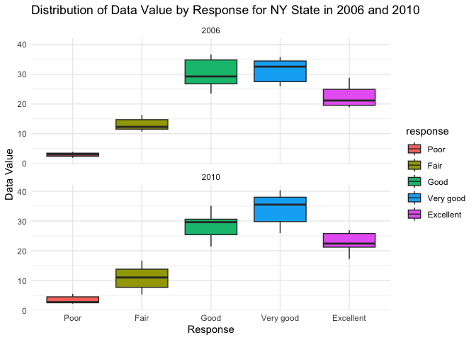
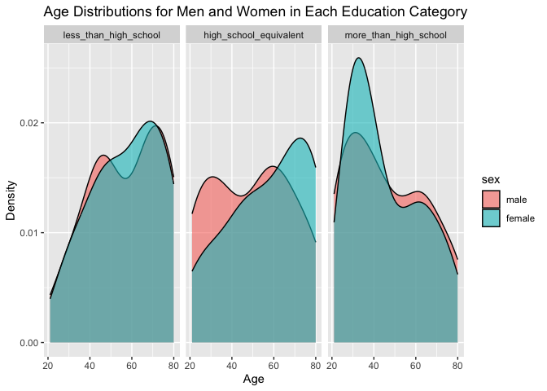

p8105_hw3_lc3807.Rmd
================
Linshen Cai
2023-10-13

## Problem 1

## Load data set

``` r
library(p8105.datasets)
data("instacart")

instacart = 
  instacart |> 
  as_tibble()
```

This dataset contains 1384617 rows and 15 columns, with each row
resprenting a single product from an instacart order. Variables include
identifiers for user, order, and product; the order in which each
product was added to the cart. There are several order-level variables,
describing the day and time of the order, and number of days since prior
order. Then there are several item-specific variables, describing the
product name (e.g. Yogurt, Avocado), department (e.g. dairy and eggs,
produce), and aisle (e.g. yogurt, fresh fruits), and whether the item
has been ordered by this user in the past. In total, there are 39123
products found in 131209 orders from 131209 distinct users.

## Summarizing the number of items ordered from aisle

``` r
instacart |> 
  count(aisle) |> 
  arrange(desc(n))
```

    ## # A tibble: 134 × 2
    ##    aisle                              n
    ##    <chr>                          <int>
    ##  1 fresh vegetables              150609
    ##  2 fresh fruits                  150473
    ##  3 packaged vegetables fruits     78493
    ##  4 yogurt                         55240
    ##  5 packaged cheese                41699
    ##  6 water seltzer sparkling water  36617
    ##  7 milk                           32644
    ##  8 chips pretzels                 31269
    ##  9 soy lactosefree                26240
    ## 10 bread                          23635
    ## # ℹ 124 more rows

Above is a table summarizing the number of items ordered from aisle. In
total, there are 134 aisles, with fresh vegetables and fresh fruits
holding the most items ordered by far.

## Plot the scatter plot

``` r
instacart |> 
  count(aisle) |> 
  filter(n > 10000) |> 
  mutate(aisle = fct_reorder(aisle, n)) |> 
  ggplot(aes(x = aisle, y = n)) + 
  geom_point() + 
  labs(title = "Number of items ordered in each aisle") +
  theme(axis.text.x = element_text(angle = 60, hjust = 1))
```

<!-- -->

Above is a plot that shows the number of items ordered in each aisle.
Here, aisles are ordered by ascending number of items.

## Show the three most popular items

``` r
instacart |> 
  filter(aisle %in% c("baking ingredients", "dog food care", "packaged vegetables fruits")) |>
  group_by(aisle) |> 
  count(product_name) |> 
  mutate(rank = min_rank(desc(n))) |> 
  filter(rank < 4) |> 
  arrange(desc(n)) |>
  knitr::kable()
```

| aisle                      | product_name                                  |    n | rank |
|:---------------------------|:----------------------------------------------|-----:|-----:|
| packaged vegetables fruits | Organic Baby Spinach                          | 9784 |    1 |
| packaged vegetables fruits | Organic Raspberries                           | 5546 |    2 |
| packaged vegetables fruits | Organic Blueberries                           | 4966 |    3 |
| baking ingredients         | Light Brown Sugar                             |  499 |    1 |
| baking ingredients         | Pure Baking Soda                              |  387 |    2 |
| baking ingredients         | Cane Sugar                                    |  336 |    3 |
| dog food care              | Snack Sticks Chicken & Rice Recipe Dog Treats |   30 |    1 |
| dog food care              | Organix Chicken & Brown Rice Recipe           |   28 |    2 |
| dog food care              | Small Dog Biscuits                            |   26 |    3 |

The table shows the three most popular items in aisles
`baking ingredients`, `dog food care`, and `packaged vegetables fruits`,
and includes the number of times each item is ordered in your table.

## The mean hour of the day

``` r
instacart |>
  filter(product_name %in% c("Pink Lady Apples", "Coffee Ice Cream")) |>
  group_by(product_name, order_dow) |>
  summarize(mean_hour = mean(order_hour_of_day)) |>
  pivot_wider(
    names_from = order_dow, 
    values_from = mean_hour) |>
  knitr::kable(digits = 2)
```

    ## `summarise()` has grouped output by 'product_name'. You can override using the
    ## `.groups` argument.

| product_name     |     0 |     1 |     2 |     3 |     4 |     5 |     6 |
|:-----------------|------:|------:|------:|------:|------:|------:|------:|
| Coffee Ice Cream | 13.77 | 14.32 | 15.38 | 15.32 | 15.22 | 12.26 | 13.83 |
| Pink Lady Apples | 13.44 | 11.36 | 11.70 | 14.25 | 11.55 | 12.78 | 11.94 |

Finally, this is a table showing the mean hour of the day at which Pink
Lady Apples and Coffee Ice Cream are ordered on each day of the week.
This table has been formatted in an untidy manner for human readers.
Pink Lady Apples are generally purchased slightly earlier in the day
than Coffee Ice Cream, with the exception of day 5.

## Problem 2

## Load the data and do some data cleaning

``` r
library(p8105.datasets)
data("brfss_smart2010")

# data cleaning
brfss_smart2010 = 
  brfss_smart2010 |> 
  as_tibble() |> 
  janitor::clean_names() |> 
  rename(state = locationabbr)

brfss_smart2010 = brfss_smart2010 |> 
  filter(topic == "Overall Health",
         response %in% c("Excellent", "Very good", "Good", "Fair", "Poor")
         ) |> 
  mutate(response = factor(response, levels = c("Poor", "Fair", "Good", "Very good", "Excellent")))
```

This dataset contains 10625 rows and 23 columns, with each row
representing the number of response about their overall health from
“Poor” to “Excellent” in different location of all states every year.

``` r
# count states with 7 or more location oberved in 2020
state_counts_2002 = brfss_smart2010 |> 
  filter(year == 2002) |> 
  group_by(state) |> 
  summarize(NumObservations = n_distinct(locationdesc)) |> 
  filter(NumObservations >= 7)
# count states with 7 or more location oberved in 2010
state_counts_2010 = brfss_smart2010 |> 
  filter(year == 2010) |> 
  group_by(state) |> 
  summarize(NumObservations =  n_distinct(locationdesc)) |> 
  filter(NumObservations >= 7)
```

In 2002, there are 6 states were observed at 7 or more locations. They
are CT, FL, MA, NC, NJ, PA. In 2010, there are 14 states were observed
at 7 or more locations. They are CA, CO, FL, MA, MD, NC, NE, NJ, NY, OH,
PA, SC, TX, WA.

``` r
# Filter the data for "Excellent" responses
response_excellent = brfss_smart2010 |> 
  filter(response == "Excellent") 
# Caculate averages data_value
state_response_excellent = response_excellent |> 
  group_by(year,state) |> 
  summarize(mean_data_value = mean(data_value, na.rm = TRUE))
```

    ## `summarise()` has grouped output by 'year'. You can override using the
    ## `.groups` argument.

``` r
# Make plot
state_response_excellent |> 
  ggplot(aes(x = year, y = mean_data_value, color = state)) +
  geom_line() +
  labs(title = "Averages Data_value for Each State",
      x = "Years",
      y = "Average data value")
```

<!-- -->

Above is plot showing averages data_value across locations for each
state across years.There isn’t a yearly trend.

``` r
# Creat dataframe for only year is 2006 or 2010
state_counts_2006_2010 = brfss_smart2010 |> 
  filter(year == 2006 | year == 2010, state == "NY")
# Make two-panel plot
state_counts_2006_2010 |> 
  ggplot(aes(x = response, y = data_value, fill = response )) +
  geom_boxplot()+ 
  facet_wrap(~ year, nrow = 2) +
  labs(title = "Distribution of Data Value by Response for NY State in 2006 and 2010",
       x = "Response",
       y = "Data Value") +
  theme_minimal()
```

<!-- -->

The above two-panel plot shows distribution of data value for responses
(“Poor” to “Excellent”) among locations in NY State for the years 2006,
and 2010. The distribution is similar between 2006 and 2010, and the
rankings of the mean data value are very good, good, excellent, fair,
and poor. The mean value for good, very good, and excellent is higher in
2010. Additionally, we can see that the “poor” group had the lowest
variation throughout the course of both years.

## Problem 3

## Load, tidy, merge, and otherwise organize the data sets

``` r
# import nhabes_covar.csv and clean it
nhanes_covar = read.csv("./data/nhanes_covar.csv", skip = 4) |> 
  drop_na() |> 
  filter(age >=21) |> 
  janitor::clean_names() |> 
  mutate(
    sex = ifelse(sex == 1, "male", "female"),
    sex = factor (sex, levels = c("male", "female")),
    education = recode(education, "1" = "less_than_high_school", 
                            "2" = "high_school_equivalent", 
                            "3" = "more_than_high_school"),
    education = factor(education, 
                       levels = c("less_than_high_school","high_school_equivalent","more_than_high_school")
                       )
  )
# import nhabes_accel.csv and clean it
nhanes_accel = read.csv("./data/nhanes_accel.csv") |> 
  janitor::clean_names()|> 
  pivot_longer(
    min1:min1440,
    names_to = "minutes",
    values_to = "mims_value")
# merge two dataframes

nhanes_merge = left_join(nhanes_covar, nhanes_accel, by = "seqn")
```

## Table for the number of men and women in each education category and create a visualization of the age distributions

``` r
# Creat table for the number of men and women in each education category
nhanes_count = nhanes_merge |> 
  group_by(education,sex) |> 
  summarise(n=n())
```

    ## `summarise()` has grouped output by 'education'. You can override using the
    ## `.groups` argument.

``` r
# Create a visualization of the age distributions 
nhanes_covar |> 
  ggplot(aes(x = age , fill = sex,))+
  geom_density(alpha = 0.6)+
  facet_grid(~education) +
  labs(title = "Age Distributions for Men and Women in Each Education Category",
       x = "Age",
       y = "Density")
```

<!-- -->

According to table, there are no big difference between the number male
and the number of female in each in each education category. However, in
education category “More Than High School”, the number of female with
age between 25 and 40 is much larger than the number of female with same
age based on density plot. In other words, in more than high school
level, female has a slightly younger age.

## Create a total activity variable for each participant. Plot these total activities against age

``` r
# Create a table with total activity variable
nhanes_total_activity = nhanes_merge |>
  group_by(seqn,age,sex,education) |> 
  summarise(total_activity = sum(mims_value)) 
```

    ## `summarise()` has grouped output by 'seqn', 'age', 'sex'. You can override
    ## using the `.groups` argument.

``` r
# Plot these total activities against age
nhanes_total_activity |> 
  ggplot(aes(x = age, y = total_activity, color = sex)) +
  geom_point() +
  geom_smooth(se = FALSE) +
  facet_grid(. ~ education) +
  labs(
    title = "Total Activity against Age",
    x = "Age",
    y = "Total Activiy"
  )
```

    ## `geom_smooth()` using method = 'loess' and formula = 'y ~ x'

<!-- -->

Both genders’ overall activity tends to decline with age. Women are more
active overall before the age of 40 when they fall into the “Less than
high school education” group. Women exhibit more overall activity in the
“High school equivalent” category across most age groups. Similar to the
previous group, females consistently exhibit higher overall activity
across all age ranges in the “More than high school education” category.

``` r
# create a dataframe for plot
nhanes_merge |> 
  mutate(minutes = str_remove_all(minutes, "min"),
         minutes = as.numeric(minutes)) |>
  arrange(minutes) |>
# Make three-panel plot
  ggplot(aes(x = minutes, y = mims_value, color = sex)) +
  geom_point(alpha = 0.3) +
  facet_wrap(~ education) +
  geom_smooth(se = FALSE) +
  labs(title = "24-hour Activity Time Courses for Each Education Level and Sex",
       x = "Time",
       y = "MIMS Value")+
  theme_minimal()
```

    ## `geom_smooth()` using method = 'gam' and formula = 'y ~ s(x, bs = "cs")'

<!-- -->

Based on the chart, I found that regardless of education level, men and
women have the same activi trends throughout the 24-hours a day.
